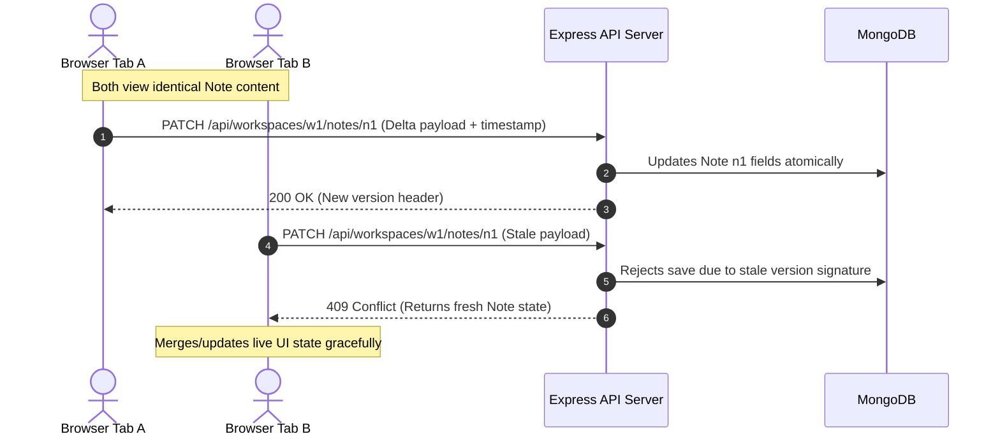

# Text Pad Standardization Roadmap: From Premium MVP to Elite Product

To elevate **Text Pad** from a premium minimal viable product into an elite, industry-standard engineering benchmark, we must systemically target our core architectural bottlenecks and UX edge cases. 

Below is the execution strategy to systematically eliminate every identified flaw, structured into actionable implementation phases.

---

## Phase 1: Breaking Component Monoliths & Modularizing Architecture

Currently, `NoteEditor.jsx` handles state layout, DOM manipulations, rich-text commands, canvas line painting, and complex network debouncing inside a single **2,000+ line file**.

### Architectural Standard: Domain-Driven Sub-Components
We will refactor the editor logic into highly isolated, testable modules inside a dedicated folder structure:

```text
client/src/components/editor/
├── hooks/
│   ├── useTransliteration.js     # Manages physical maps, Google API calls, and debouncing
│   ├── useRuledCanvas.js         # Handles ResizeObserver and canvas ruled line calculations
│   └── useEditorSelection.js     # Captures, saves, and restores precise DOM ranges
├── ui/
│   ├── EditorStudioToolbar.jsx   # Pure functional component for font/size dropdowns
│   ├── FormattingQuickBar.jsx    # Renders Bold, Italic, and BlockTag controls
│   ├── PaperPaletteControls.jsx  # Swatches and dynamic hex color-wheel pickers
│   └── VirtualKeyboardDrawer.jsx # Native tap-layout overlay drawer
└── NoteEditorRoot.jsx            # Clean composition root (under 250 lines)
```

**Why this sets the standard:** 
Separation of concerns allows parallel development, straightforward unit testing of individual features (like linguistic transliteration logic), and drastically improves file readability for new engineers joining the project.

---

## Phase 2: Upgrading the Editor Engines

### 1. Note Studio: Deprecating `document.execCommand`
Relying on raw DOM native text formatting (`execCommand`) leads to severe cross-browser formatting inconsistencies (WebKit vs. Gecko vs. Blink engines).

* **The Standard Solution:** Migrate the content container to a headless schema framework like **TipTap** or **Lexical**.
* **Impact:** 
  * Unifies formatting range controls perfectly across mobile and desktop surfaces.
  * Outputs validated, highly structured HTML or JSON structures, preventing injected script bugs.
  * Facilitates advanced extensions (e.g. inserting custom image nodes or tables later with zero friction).

### 2. Code Studio: Transitioning Beyond Raw Textareas
The current Code Studio uses a plain monospaced `<textarea>` synced with a line counter array.

* **The Standard Solution:** Embed a lightweight, headless instance of **CodeMirror 6** or **Monaco Editor** customized with minimal themes that align with our custom analog paper tokens.
* **Impact:**
  * Delivers highly optimized, multi-language automatic syntax coloring.
  * Adds native line-folding, smooth soft-wraps, bracket auto-closing, and automatic block indents while preserving the unencumbered scratchpad feel.

---

## Phase 3: High-Fidelity UX & Navigation Enhancements

### 1. Seamless Workspace Reopening (Eliminating Manual Lookup)
Users should never be forced to memorize arbitrary string tokens to return to their digital workspace.

* **The Standard Solution:** Implement a secure client-side buffer using `localStorage` or `IndexedDB` mapped to an encrypted list of recently accessed Workspace IDs.
* **Design Implementation:** Introduce a premium, glassmorphic dropdown or sliding horizontal card strip directly beneath the main `WorkspaceGate` input labeled *"Recent Studios"*. A single click injects the ID and prompts for the password automatically.

### 2. Fluid Touchscreen Transitions
Switching between the list overlay and the active editing surface on narrow mobile viewports must feel instant and dynamic.

* **The Standard Solution:** Integrate fluid, physics-based gesture navigation (using spring animations via `framer-motion` or standard CSS transition states). 
* **Design Implementation:** Allow users to edge-swipe horizontally from the left border to slide the sidebar list into view smoothly over the editor canvas without losing internal focus/caret parameters.

### 3. Actionable In-App Documentation
Static documentation forces users to read instructions, leave the page, and manually execute settings modifications.

* **The Standard Solution:** Embed live React Context consumer triggers directly inside `DocsPage.jsx`.
* **Design Implementation:** When a user reads the section describing *"Auto-replace typing shortcuts"*, display an inline, real-time toggle card directly inside the documentation layout to instantly query and update the active workspace settings database.

---

## Phase 4: Atomic Syncing & Concurrency Safety

The current backend API logic saves entire string lists whenever a context switch occurs, resulting in silent background overwrites if a user multi-tabs the same workspace simultaneously.



### The Standard Solution: REST Delta Patches & Optimistic UI
1. **Granular Endpoints:** Transition from monolithic parent saves to atomic sub-document modification routes:
   * `PATCH /api/workspaces/:id/notes/:noteId`
   * `PATCH /api/workspaces/:id/codes/:codeId`
2. **Optimistic Locking:** Inject a lightweight version sequence (`__v` or `updatedAt` stamps) into client requests. If an incoming patch carries a stale version compared to the live database, return a `409 Conflict` containing the fresh payload to reconcile safely.
3. **Cross-Tab Broadcasts:** Integrate lightweight **Server-Sent Events (SSE)** or utilize native Web browser `BroadcastChannel` APIs to instantly signal secondary open tabs of local updates, maintaining perfectly synchronized local state across multiple open windows.

---

## Standardization Scorecard

| Area | Current Implementation | Elite Benchmark Target | Implementation Complexity |
| :--- | :--- | :--- | :--- |
| **Component Layout** | Monolithic 2,000-line blocks | Decoupled atomic modules & logic hooks | Medium |
| **Rich Text Engine** | Browser-native `execCommand` | Headless schema engine (TipTap/Lexical) | High |
| **Code Editor** | Plain `<textarea>` surface | Minimalized CodeMirror 6 integration | Medium |
| **Reopen Experience** | Strict manual ID typing | Encrypted local quick-select ring buffer | Low |
| **Mobile Navigation** | Multi-tap toggle overlays | Physics-based gesture-swipe drawers | Medium |
| **Data Syncing** | Full arrays payload upload | Atomic delta PATCH logic + Version checks | High |
